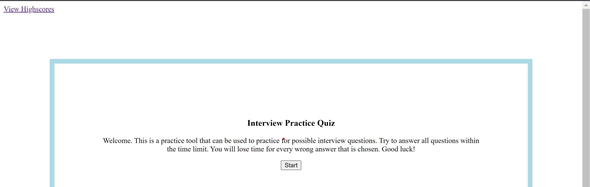

# Practice Interview Quiz

This project was created for the University of Denver coding bootcamp.
I created this as a quiz resource to use to practice possible questions I may get when applying and interviewing for jobs.

## Usage

When using this quiz, you will be first instructed to the main intorduction page.
There is a start button to start the quiz and a view highscores link at the top left of the page. This will take you to the highscore leaderboard.

Upon pressing start, you will be answering questions, one at a time. A timer will also appear at the top right of the page.

Upon answering each question, you will get be notified if the answer was correct or incorrect. If incorrect, the timer will deduct 10 seconds.

Upon answering all questions or when the timer reaches zero, you wil see the quiz over page.
This page will show you your score and will let you submit your score the the high scores board.

If you submit, the highscores board will be displayed, including your most recent score. Here you can select to go back to the quiz and play again, or you can reset the highscore board erasing all of your scores.

deployed product: https://antonio11duran.github.io/Practice-Interview-Quiz/
